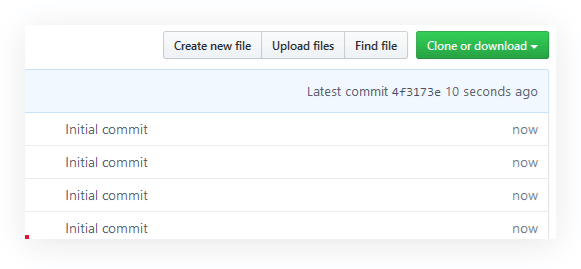
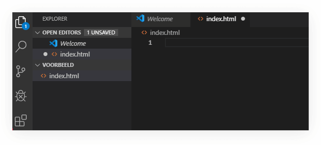
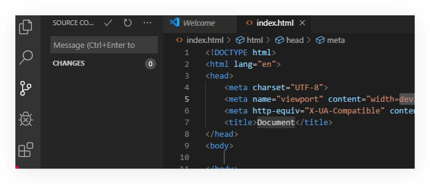
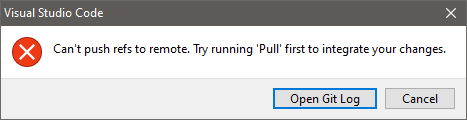
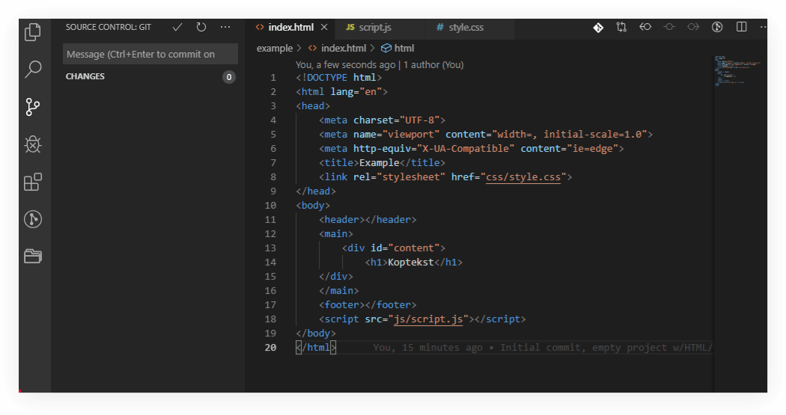
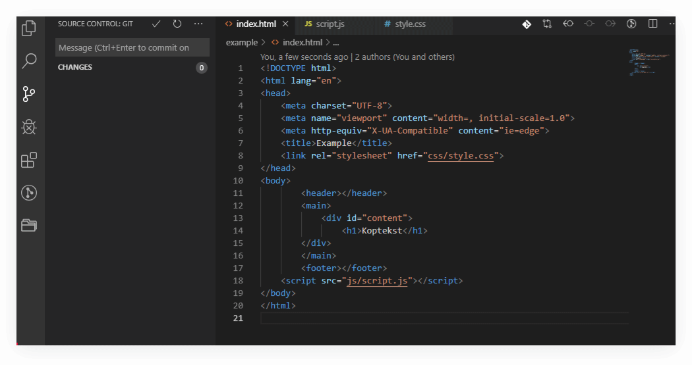
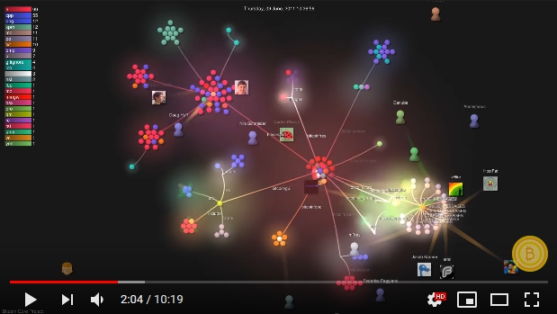
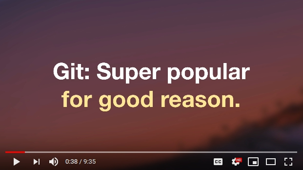

# Git

Git is een versiebeheer systeem. We gebruiken dit systeem binnen de opleiding om code waar je aan werkt bij te houden en in te leveren. 

- [Git](#git)
  - [Werkwijze](#werkwijze)
    - [Alleen werken](#alleen-werken)
    - [Samenwerken](#samenwerken)
    - [Github Classroom](#github-classroom)
      - [Een assignment accepteren](#een-assignment-accepteren)
    - [Werken met Git en Github](#werken-met-git-en-github)
      - [Git clone](#git-clone)
      - [Git Commit](#git-commit)
      - [Files stagen voor een commit](#files-stagen-voor-een-commit)
      - [Git push](#git-push)
      - [Git pull](#git-pull)
      - [Merge Conflicts oplossen](#merge-conflicts-oplossen)
      - [Git branching](#git-branching)
      - [Git checkout](#git-checkout)
    - [Wat is...](#wat-is)
      - [Wat is een Repository?](#wat-is-een-repository)
      - [Wat is een Commit?](#wat-is-een-commit)
      - [Wat is een Merge Conflict?](#wat-is-een-merge-conflict)
  - [Meer weten?](#meer-weten)
    - [Links](#links)
    - [Link: History of Bitcoin 2009-2018 (Git Visualization)](#link-history-of-bitcoin-2009-2018-git-visualization)
    - [Link: Wat is Version Control](#link-wat-is-version-control)

## Werkwijze

### Alleen werken

De werkwijze voor het omgaan met Git, Github en Github Classroom als jij de enige bent die code aanpast bestaat uit de volgende stappen:

1. [Accepteer een assignment](#een-assignment-accepteren)  
2. [Clone](#git-clone) de assignment [Repository](#wat-is-een-repository) met eventuele starterscode
3. Werk aan de assignment
4. Doe een [commit](#git-commit) van werkende (of deels werkende) code.

> Het is een goede gewoonte om eerder teveel dan te weinig commits te maken. "Commit early, commit often" is de slogan. Je kunt dan altijd terug gaan naar een vorige versie/commit van je code zonder dat de code die je daarna hebt gemaakt (maar wél gecommit!) verloren gaat. Zie [Git checkout](#git-checkout).

5. [Push](#git-push) je code naar Github

### Samenwerken

Als je samenwerkt met anderen via Github dan kan het zijn dat iemand veranderingen in een bestand waar jij aan werkt heeft gepushed voordat jij dit kon doen. Het bestand op Github (in de remote repository) is dan een versie later dan de versie waar jij in gewerkt hebt. Als je dan jouw code probeert te pushen krijg je een melding dat je [Merge Conflicts](#wat-is-een-merge-conflict) hebt. 

>Dit lijkt als je net begint met Git alleen maar voor problemen te zorgen, waarom kan dat niet makkelijker zoals met OneDrive? OneDrive lijkt misschien _nu_ nog een betere, en vooral simpelere oplossing maar uiteindelijk zijn het twee verschillende tools met allebei een ander doel. Wat Git vooral geeft is de mogelijkheid om met héél veel ontwikkelaars asynchroon (los van elkaar) samen aan een project te werken. Zie [History of Bitcoin 2009-2018](#link-history-of-bitcoin-2009-2018-git-visualization) voor een visualisatie van een project met veel ontwikkelaars.

Als je geprobeerd hebt een Git push te doen en Git geeft aan dat het niet kan dan moet je eerst een Git pull doen en eventuele merge conflicts oplossen voor je de laatste versie van de code kan pushen. De stappen zoals die bij [Alleen werken](#alleen-werken) staan worden dan aangevuld met de onderstaande stappen: 

6. Voer een [Git pull](#git-pull) uit
7. [Merge conflicts oplossen](#merge-conflicts-oplossen)
8. Gemengde bestanden opslaan & committen
9. Git push

Gelukkig biedt VS code allerlei tools om [Merge conflicts op te lossen](#merge-conflicts-oplossen).


### Github Classroom

#### Een assignment accepteren

Via mail of Teams krijg je een link toegestuurd. Als je deze opent kan je de assignment accepteren en wordt er een Repository voor je aangemaakt. Deze is genaamd naar de naam van de assignment + jouw github naam gescheiden met een dash (-). Om de assignment naar je laptop te kopieren moet je de op Github aangemaakte [Repository](#wat-is-een-Repository) clonen, zie [Git clone](#Git-clone)

### Werken met Git en Github

#### Git clone

Een Repository clonen betekent de code vanuit een remote Repository, zoals die bijvoorbeeld op Github wordt gehost, naar de je laptop kopieeren. Je hebt dan een lokale versie van de code staan waarin je kan werken.

Om een Repository te clonen doe je het volgende:

1. Kopieer de link van je Repository op Github naar je klembord  

   

2. Als je nog geen map hebt voor de assignments voor het vak of de periode maak deze aan.   
3. Open de map in VS code: File > Open Folder  
   > 
4. Open een nieuwe terminal: Terminal > New Terminal  
   >
5. Voer uit: ```git clone <paste de link van je github repository>``` 

Er is nu een nieuwe submap aangemaakt met daarin de starterscode van de assignment. Open deze map in VS Code om aan de code te werken. 

#### Git Commit

Een commit maken betekent dat je een snapshot van een of meerdere bestanden toevoegt aan je lokale Repository. Je voorziet een commit altijd van een korte relevante tekst (een commit message) zodat je later weet wat de staat is van de code in die commit.  
>Bijvoorbeeld: "opdracht 1 af" als je een opdracht af heb, "functie voor ... uitgewerkt" als je binnen een opdracht een functie voor iets specifieks hebt gemaakt of "commentaar geupdate" als je wat commentaar binnen een bestand heb aangepast.

Als je in VS code een commit maakt zonder dat de bestanden eerste gestaged zijn dan vraagt VS code heel handig of je die stap automatisch wilt doen voor alle bestanden die zijn veranderd. Zie [Een file stagen voor een commit](#files-stagen-voor-een-commit) om te zien waarom je misschien zelf wilt bepalen welke bestanden je staged en hoe dat moet in VS code.  

#### Files stagen voor een commit

Het kan zijn dat je in veel verschillende bestanden hebt gewerkt aan het opdracht en nog niks hebt toegevoegd aan je lokale Repository via een commit. Uiteindelijk wil je graag een snapshot hebben waarin bijvoorbeeld 1 opdracht of een deel van de code is uitgewerkt. Doe dit door de relevante bestanden eerst te stagen (klaarzetten voor een commit) en daarna een commit uit te voeren. In VS code stage je bestanden door op het plusje naast de bestandsnaam te klikken. 

Hieronder zie je hoe je een bestand staged en daarna commit in VS code:


#### Git push

Een git push voer je uit om de bestanden zoals die zijn opgeslagen in je local repository te kopieeren naar Github (de remote repository). 

Hieronder zie je hoe je een Git Push uitvoert in VS code:


#### Git pull

Een git pull betekend de laatste versie van bestanden ophalen uit een remote repository (van Github) en deze samenvoegen met de bestanden die jij lokaal hebt staan. 

> Eigenlijk doet Git twee dingen voor je wanneer je een git pull uitvoert. Git voert eerst een Git fetch uit, dit haalt de bestanden op en voert dan een git merge uit, dit voegt de bestanden samen.

#### Merge Conflicts oplossen

Een Merge conflict vindt plaats als de bestanden die je binnen haalt van een remote Repository anders zijn dan de bestanden die je lokaal hebt staan in je working directory. Gelukkig geeft Visual Studio code je een gemakkelijke manier om de verschillen versies samen te voegen.

Als je een `git push` uitvoert in VS Code dan krijg je de onderstaande foutmelding te zien 



Als je dan een `git pull` uitvoert probeert git de veranderingen die in de remote repository op github staan samen te voegen met de veranderingen die jij in je lokale repository hebt staan. Vaak kan Git dit zelf oplossen en _merged_ Git de bestanden voor je. Maar soms kan Git niet zelf beslissen welke versie van de code de juiste is. 



In bovenstaande gif zie je wat VS Code dan voor opties aanbiedt. Er zijn twee _changes_: de Incoming Change (in het blauw), die van Github af komt en de Current Change (in het groen), de verandering die je lokaal hebt gemaakt. 

In het bovenstaande voorbeeld is de Incoming Change de juiste: dus je kiest voor het accepteren van de Incoming Change bij de rij opties boven de changes in VS Code. De volledige workflow nadat een `git push` niet lukt ziet er dan als volgt uit:



> **LETOP!** Nadat je een merge conflict hebt opgelost moet je het bestand opslaan en de changes stagen en commiten in je lokale repository voor je weer een `git push` doet.

Als je samenwerkt kan het ook zijn dat beide changes correcte code bevatten. Je kan dan ervoor kiezen beide changes te accepteren. In zo'n geval kan het zijn dat er wat dubbele code overblijft, deze moet je dan nadat je een merge conflict hebt opgelost verwijderen voor je uiteindelijk het correct gemergde bestand weer commit en pushed.

Uiteraard kun je veel conflicten vermijden door samen af te spreken wie waar precies aan werkt en in welke bestanden. Als je dan wilt werken aan een bestand waarvan je weet dat je mede ontwikkelaar aanpassingen heeft gedaan (en gepushed!) dan kun je voor jij begint aan je werk eerst een `git pull` doen om het laatste werk op te halen.

#### Git branching

#### Git checkout

### Wat is...

#### Wat is een Repository?

Een Repository is een verzameling van bestanden (en mogelijk mappen) met code die door Git wordt getracked, d.w.z. Git houdt de veranderingen in die bestanden bij. Je kunt een lokale Repository hebben waarin alleen jij werkt of een Repository die op een server wordt gehost, bijvoorbeeld op Github.com, waarmee je met anderen kan samenwerken aan code.  

Zo'n gehoste Repository noem je een remote Repository.  

De Repository die je lokaal hebt staan wordt de local Repository genoemd.  

>De wijzigingen worden door Git bijgehouden in een verborgen map genaamd ```.git```. Deze map wordt door Git beheerd en je hoeft hier zelf niks mee te doen. 

#### Wat is een Commit?

Een Commit is een snapshot van een of meerdere bestanden (en mogelijk mappen) op een bepaalt tijdstip. 

#### Wat is een Merge Conflict?

Een merge conflict vindt plaats als Git probeert twee bestanden samen te voegen maar het is onzeker welke regels code de juiste zijn. Git wilt dan dat jij de bestanden aanpast zodat de juiste code overblijft. Een merge conflict komt voor wanneer je een Git push uitvoert maar de bestanden op de remote repository (op Github) zijn een latere versie dan de bestanden waarmee jij werkt.

## Meer weten?

### Links
[A Visual Git Reference](https://marklodato.github.io/visual-git-guide/index-en.html)  
> Voor als je dieper in de mogelijkheden van git wilt duiken.  

[git - the simple guide](https://rogerdudler.github.io/git-guide/)


### Link: History of Bitcoin 2009-2018 (Git Visualization)

Onderstaande youtube video laat zien hoe een project waarin meerdere ontwikkelaars samenwerken tot stand komt. Elk bolletje in de video is een bestand. Bolletjes die samen staan zitten in dezelfde map. Elke keer dat er een lichtbundel schijnt vanuit een persoon naar een bestand is een commit.  
[](https://www.youtube.com/watch?v=DjYbsq3FXfM)


### Link: Wat is Version Control
[](https://www.youtube.com/watch?v=9GKpbI1siow)