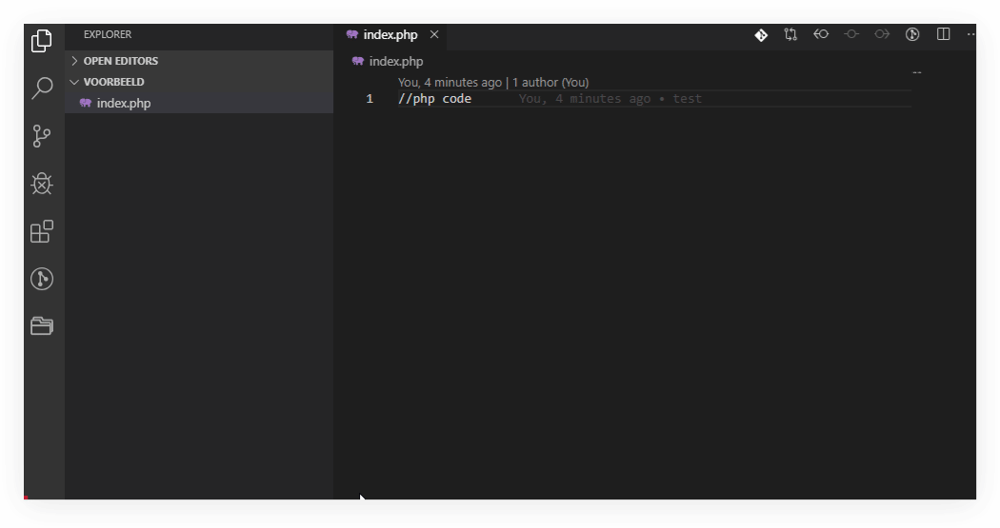

# Beter werken met PHP in VS Code

## XDebug

### Installatie:
1. Ga naar [custom installatie instructies](https://xdebug.org/wizard.php) en volg de aangegeven stappen. 
   > Om de output van phpinfo() te zien in je browser start je Apache via Xampp maak je een bestand aan genaamd phpinfo.php en zet dit in de htdocs map van je xampp installatie. Zet de code die hieronder staat in je phpinfo.php bestand:
   ```php
    <?php
    phpinfo();
    ?>
   ```
   
   Open dan [http://localhost/phpinfo.php](http://localhost/phpinfo.php) Selecteer alles (CTRL-A) op de pagina en copy paste dit in het invulveld op xdebug.org.

   >Open het php.ini bestand in Xampp via het Xampp controlle paneel > Apache > Config > PHP (php.ini)
2. In bovenstaande stap wordt alleen de zend_extension variabele toegekent met het juiste pad zoals die voor jou installatie van xampp telt. Voeg de xdebug.remote en xdebug.remote_autostart variabelen toe en maak het geheel af met een mooi kopje, zie onderstaand voorbeeld.
```
[XDebug]
zend_extension = C:\xampp\php\ext\php_xdebug-2.8.1-7.3-vc15-x86_64.dll
xdebug.remote_enable = 1
xdebug.remote_autostart = 1
```

3. Herstart Apache

4. Installeer de [PHP Debug extensie](#php-debug) (van Felix Becker) in VS code
5. Open het debug venster van VS code CTRL-SHIFT-D en kies Add Configuration > PHP. VS code maakt dan een map voor je aan genaamd ```.vscode``` met daarin een bestand genaamd ```launch.json```.  



6. De instellingen in ```launch.json``` staan als het goed is meteen goed. Maar mocht je er dingen in veranderen, die alleen specifiek voor jouw lokale setup gelden, dan is het wel handig dat anderen niet _jouw_ ```launch.json``` telkens krijgen als ze een ```git pull``` doen. Voeg daarom een bestand genaamd ```.gitignore``` toe aan je project, in de root, met een regel code: ```.vscode/*``` 

## Extensions

### PHP Debug
[PHP Debug](https://marketplace.visualstudio.com/items?itemName=felixfbecker.php-debug)  


## Reference links
[Xdebug download voor windows](https://xdebug.org/download)  
[PHP Debug extension readme](https://github.com/felixfbecker/vscode-php-debug/blob/master/README.md)  
